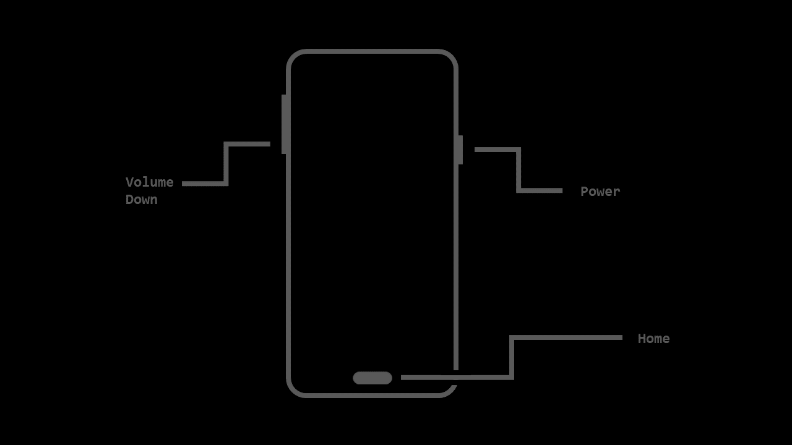
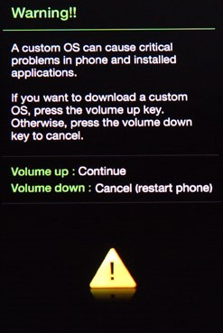
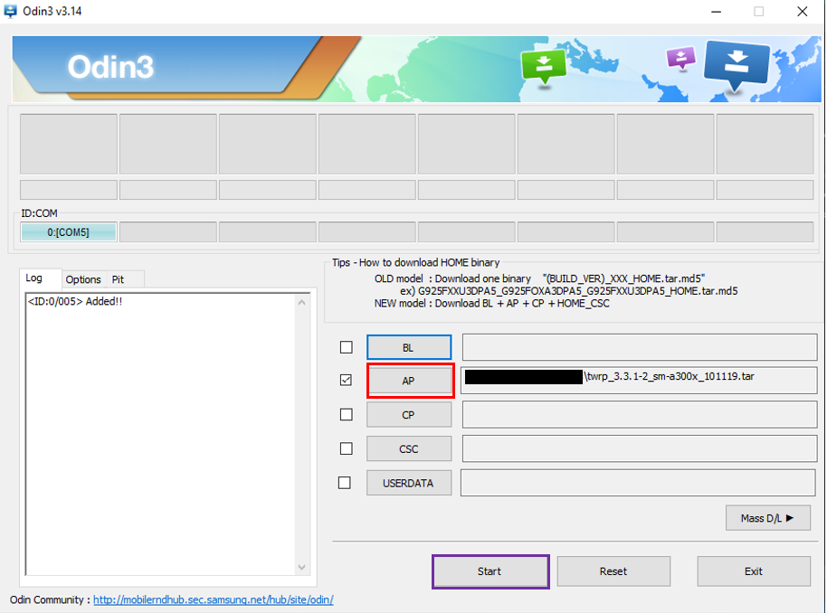

# How to install LineageOS 17.1 on the 2015 Samsung Galaxy A3 (SM-A300FU)

I know this isn't the sort of content you might expect as the first post on my blog, but here we are. I recently installed LineageOS 14 on my old 2015 Samsung Galaxy A3, and thought I would share the process if for some reason you decide to trust me more than the many other sites explaining how to do this. So, onto the guide.

**PLEASE READ ALL OF THESE INSTRUCTIONS BEFORE FOLLOWING THEM!**

## Disclaimer
    Your warranty is now void (I would be surprised if you still had one on this phone)
    I am not responsible for bricked devices, dead SD cards, thermonuclear war, or you getting fired because the alarm app failed. Please do some research if you have any concerns about installing this ROM. YOU are choosing to make these modifications. By flashing this ROM, you accept this disclaimer.

## Prerequisites
* You have access to a desktop computer running Windows, MacOS, or Linux 
* ADB is set up and accessable from all directories on your computer [(Installation guide here)](https://www.xda-developers.com/install-adb-windows-macos-linux/)
* You have access to a 2015 Samsung Galaxy S3 (SM-A300FU) (MAKE SURE IT IS THE SM-A300U MODEL)
* All data on the phone you wish to keep is backed up safely

**Download all of these before you start the installation**

* [Odin 3](https://odindownload.com/download/Odin3_v3.14.1.zip)
* [TWRP 3.31](https://androidfilehost.com/?fid=4349826312261625220)
* [LineageOS 17.1](https://androidfilehost.com/?fid=8889791610682926538)
* [OpenGapps](https://opengapps.org/) (Select ARM, 10.0, and any of the last options however I recommend Micro, some of the options higher up the list may not work.)

## Step 1 - Install TWRP

In order to flash a custom ROM, you must first install a custom recovery. These days, pretty much the only option for custom recoveries is TWRP, so that is what we are using today. 

The first thing to do is power off the device, and then boot it into download mode. This can be done by holding down the home and volume down button, then holding the power button until the samsung logo appears, at which point release all of the buttons. Alternatively, use the ADB command `adb reboot download`


You should now see the download mode screen, **do not press any buttons yet!**



Run Odin on your computer, <span style="color:red">press the button labelled "AP"</span>, and select the TWRP .tar file you downloaded. 



This part is slightly tricky, you have to time it correctly. If you don't manage to, the phone just reboots normally, and you will have to start this step again.

Plug the phone into your computer with a USB cable, and press volume up. The text box in odin should now show "added!". If it does, <span style="color: purple">click the button labelled "start".<span>

The phone will now download the new recovery, and once it is done, it will reboot. **As soon as the screen goes black, press and hold volume up and the home button.** This will now take you into the TWRP recovery. If the phone prompts you to swipe to allow modification, do so.

## Step 2 - Wipe the OS

Before we can install LineageOS, we need to remove the existing OS on the phone. To do this, go to Wipe>Advanced Wipe and check the boxes next to 'system', 'data', and 'cache'. Finally, swipe the blue arrow right to wipe the device as described. Your data on the phone may be erased, however it may also not. If you definitely want to get rid of it, press the back button until you are back to the 'Wipe' screen, and swipe to wipe again.

## Step 3 - Install LineageOS

Now to install Lineage itself. First, press the back button until you are on the main TWRP screen again. Go to Advanced>ADB Sideload, and open up a windows terminal in the same directory as the files you downloaded earlier. Swipe the arrow right to start sideload, then type the following command into your terminal:

```
adb sideload lineage-17.1-20200819-UNOFFICIAL-a3lte.zip
```

If all goes correctly, your device will have installed LineageOS. If there is an error, google it because I'm sure you are not the only person who has had this error.

## OPTIONAL Step 4 - Install OpenGApps

OpenGApps is an additional package that allows you to run google play services such as the play store on LineageOS. Unless you are experienced with installing APKs from other sources and are sure you can do without Play Services, you should probably install this.

Press 'back', and then go into 'ADB Sideload' again, before once more swiping right on the arrow.

I'm using the Micro package for this, so my filename is `open_gapps-arm-10.0-micro-20210304.zip`, therefore the command I'll type into ADB is

```
adb sideload open_gapps-arm-10.0-micro-20210304.zip
```

If you are using a different package, adjust the command to fit the name of the file you downloaded.
If the install ends with 'Updater process ended with ERROR: 70', then you must use a smaller package, such as Pico.

## Step 5 - Finishing Off

And that's it! Press the 'reboot' button, and your phone should reboot into LineageOS. **If prompted to install the TWRP app, click 'Do Not Install'** It may take a while on the boot animation, as it is setting up the OS for first use.

## Conclusion

So, that is how you install LineageOS on your phone. Moving to a custom ROM for the first time can seem intimidating, but it's really a lot more simple than it seems. I hope this guide was helpful for the very few people (if any) that ever follow it, and I look forward to writing more guides in the future!

Thanks for reading,
                        - Pr0x1mas